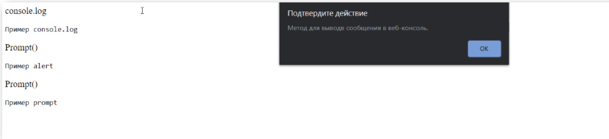

# Домашняя работа

Разработан в качестве практического задания на курсе Skillfactory модуль 6.8 Принципы работы JS

Содержит в себе 5 заданий и 6 - дополнительное. Каждое задание открывается при нажатии на его заголовок.
Каждая страница разделена на области: header, main и footer.
Применены таблицы стилей css и написаны скрипты js.

## Описание заданий

### Стартовая страница

Реализована для удобства переключения между заданиями.

### Задание 1 "Привет, мир!"

Создана страница с текстом «Посмотри в консоль, там что-то важное». В консоли страницы при запуске отображается информация «Привет, мир!».

### Задание 2 "Подсказка"
Создан обработчик события — клик для элемента с id consoleLog, при клике на этот элемент отображается alert c текстом описания метода:

Был заменен Замените текст «Пример console.log » на «Пример использования команды console.log» и аналогичные для alert и prompt.

### Задание 3 "Светофор"
Создана страница с круглым элементом, при клике на который цвет меняется в следующем порядке: зеленый - желтый - красный - зеленый - желтый - красный и т.д. Один клик — одна смена цвета. Изначально цвет элемента чёрный.

### Задание 4 Ввод текста
Создана страница с ссылкой, при клике на которую появляется окно для ввода текста. При вводе текста в окно ввода в ссылке меняется текст на введенный.

Как окно ввода использован метод prompt().
Для изменения текста в ссылке использовано свойство textContent.
Для сброса поведения ссылки по умолчанию использован preventDefault().

### Задание 5 "Перехват формы"
Создана страница с формой, где есть с поле ввода, кнопка отправки и текстовый блок с id duplicateField. При вводе текста в поле ввода (input) текст дублируется в текстовый блок с id duplicateField.

При нажатии кнопки «Вывести текст в консоль и удалить из формы» текст, написанный в input, выведен в консоли, а поле ввода и duplicateField очищены.

### Задание 6 "Модифицированный Светофор"
Решение задачи «Светофор» модифицировано таким образом, чтобы есть три разных круга (как на светофоре), смена цвета происходит при клике на любой из них. Каждый круг может принимать только один из цветов.
При этом, когда один из кругов становится «цветным», остальные становятся черными. Порядок смены цвета тот же, что и в изначальном задании 3.

## Используемые технологии

* HTML

* CSS (Bootstrap)

* JavaScript (jQuery, Popper )

* Web-fonts (Roboto)

## Как открыть/запустить

Зайти в папку сайта в файловом менеджере, кликнуть 2 раза по файлу index.html.
Далее можно перемещаться по заданиям, щелкая по их названиям и возвращаться на главную страницу, нажав в области футора на кнопку "Главная".